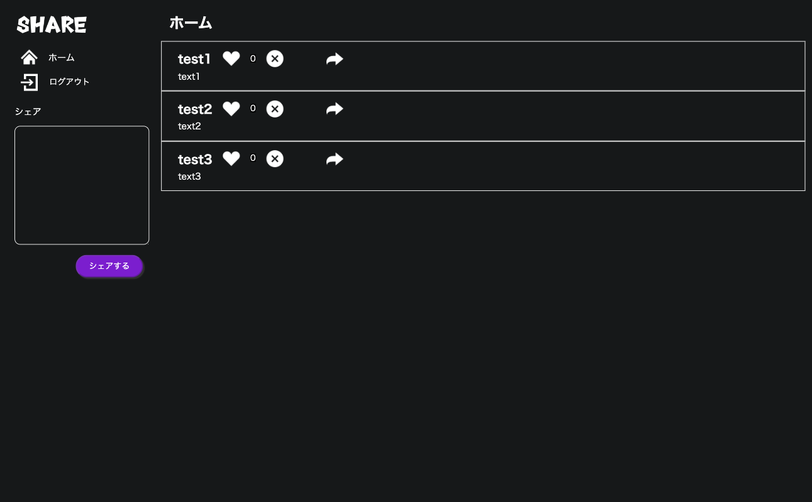
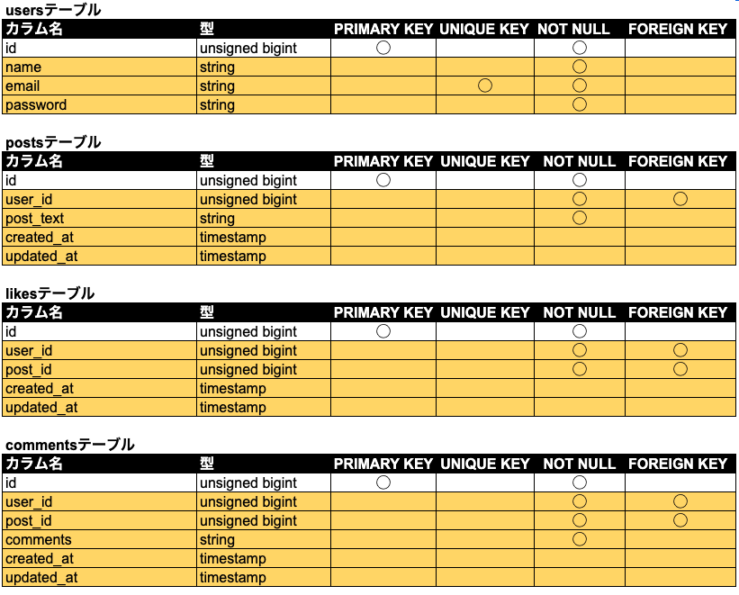
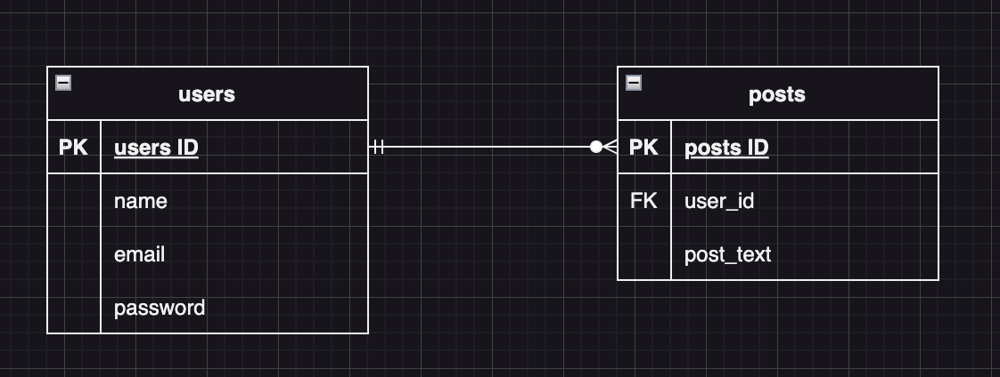
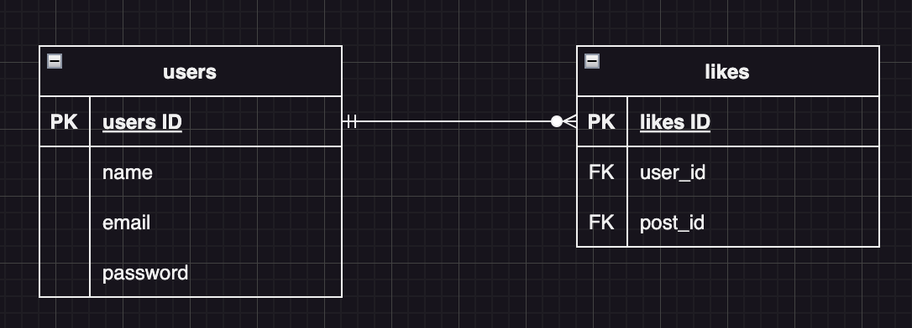
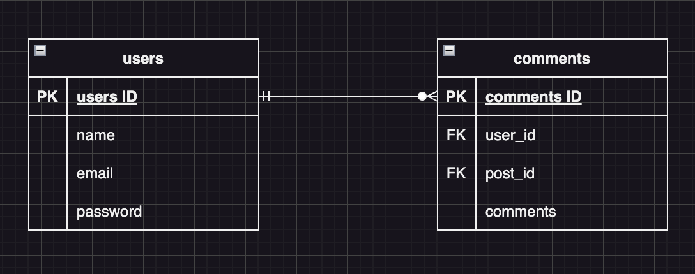
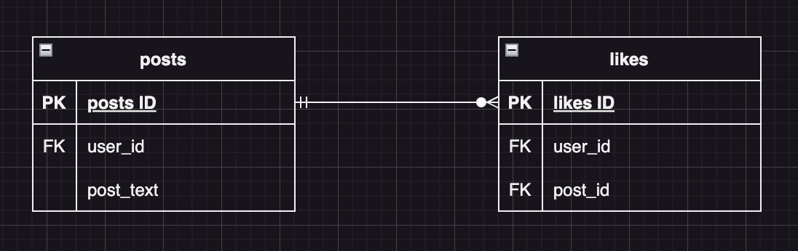
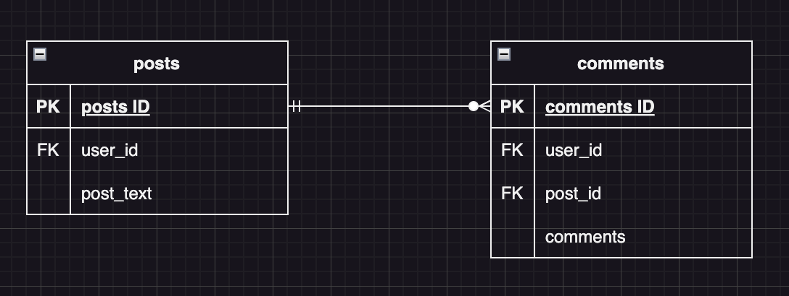

# Twitter風SNSアプリ

【概要】Twitter風SNSアプリ

【イメージ】



## 作成した目的

【背景と目的】 何気ないことをつぶやくことができるTwitter風SNSアプリを作成する。


## 機能一覧

| 項目 |
| ---- |
| ユーザー認証（Firebase Authentication） |
| 投稿の一覧表示　追加処理　削除処理 |
| 投稿した名前と投稿内容が表示される |
| 投稿の追加 |
| バツマークを押すと投稿が削除される |
| いいね機能 |
| ハートマークを押すと良いね数が増えたり減ったりする |
| コメント機能 |
| 矢印マークを押すとコメント画面に遷移する |
| コメントした名前と投稿内容が表示される |
| コメントの追加 |

## 使用技術

* PHP v8.1
* Laravel v10.48.4
* mySQL 8.3.0


## テーブル設計



## ER図








# 環境構築

## git clone

先にコピーを保存したいディレクトリに移動してから以下のコマンドを実行します。

`$ git clone git@github.com:magmag6240/apipj.git`

これでLaravelプロジェクトがローカル環境にクローンされます。

## vendorディレクトリを作る(Laravel)
以下のコマンドを実行してください。

`$ composer install`

`composer.lock`, `composer.json`に書かれた情報を基にパッケージやライブラリがまとめてインストールされ、`vendor`ディレクトリに配置されます。

## データベースの準備（Laravel）
MySQLにてsnsapipjというデータベースを以下のコマンドで作成してください。

`CREATE DATABASE snsapipj;`

次にテスト用のデータベースを用意します。
config/database.phpを開き、mysqlの部分をコピーしてmysqlの部分の下にmysql_testを作成します。  

'mysql_test' => [  
    'driver' => 'mysql',  
    'url' => env('DATABASE_URL'),  
    'host' => env('DB_HOST', '127.0.0.1'),  
    'port' => env('DB_PORT', '3306'),  
    'database' => 'snsapipj_test',  
    'username' => 'root',  
    'password' => '',  
    'unix_socket' => env('DB_SOCKET', ''),  
    'charset' => 'utf8mb4',  
    'collation' => 'utf8mb4_unicode_ci',  
    'prefix' => '',  
    'prefix_indexes' => true,  
    'strict' => true,  
    'engine' => null,  
    'options' => extension_loaded('pdo_mysql') ? array_filter([  
    PDO::MYSQL_ATTR_SSL_CA => env('MYSQL_ATTR_SSL_CA'),  
    ]) : [],  
],  

MySQLにて以下のコマンドでsnsapipj_testというデータベースを作成しましょう。

`CREATE DATABASE snsapipj_test;`

次に、テーブル作成のartisanコマンドを実行して、テストDBにテーブルを作成します。
以下のコマンドを実行してください。

`php artisan migrate:fresh --database=mysql_test`


テストDBをテストの実行で使用するには、phpunit.xmlの編集が必要です。
phpunit.xmlを以下のように編集してください。

```
<?xml version="1.0" encoding="UTF-8"?>  
<phpunit xmlns:xsi="http://www.w3.org/2001/XMLSchema-instance"
xsi:noNamespaceSchemaLocation="./vendor/phpunit/phpunit/phpunit.xsd"
bootstrap="vendor/autoload.php"
colors="true"
>  
  <testsuites>  
    <testsuite name="Unit">  
      <directory suffix="Test.php">./tests/Unit</directory>  
    </testsuite>  
    <testsuite name="Feature">  
      <directory suffix="Test.php">./tests/Feature</directory>  
    </testsuite>  
  </testsuites>  
  <coverage processUncoveredFiles="true">  
    <include>  
      <directory suffix=".php">./app</directory>  
    </include>  
  </coverage>  
  <php>  
    <server name="APP_ENV" value="testing"/>  
    <server name="BCRYPT_ROUNDS" value="4"/>  
    <server name="CACHE_DRIVER" value="array"/>  
    <server name="DB_CONNECTION" value="mysql_test"/>  
    <server name="MAIL_MAILER" value="array"/>  
    <server name="QUEUE_CONNECTION" value="sync"/>  
    <server name="SESSION_DRIVER" value="array"/>  
    <server name="TELESCOPE_ENABLED" value="false"/>  
  </php>  
</phpunit>  
```

## .envファイルを作る
git cloneしてきたプロジェクトに入っている`.env.example`ファイルを基に以下のコマンド実行で`.env`ファイルを作成します。

`$ cp .env.example .env`
`$ exit`

作成後、`.env`ファイルの内容を以下のように修正します。

// 前略

DB_CONNECTION=mysql  
DB_HOST=mysql  
DB_PORT=3306  
DB_DATABASE=snsapipj_test  
DB_USERNAME=root  
DB_PASSWORD=  

// 後略

## アプリケーションキーを初期化する
以下のコマンドで初期化を行います。

`$ php artisan key:generate`

## 動作確認
ブラウザに表示する準備は整いました。
以下のコマンド実行で、動作確認を行ってください。

`$ php artisan serve`


## ユーザー

* 一般会員（使用可能）：3人


### 一般会員

| id | name | email | password |
| ---- | ---- | ---- | ---- |
| 1 | test1 | test1@example.com | password |
| 2 | test2 | test2@example.com | password |
| 3 | test3 | test3@example.com | password |
